# wangrunji0408 本科项目作品集

> Q：时间都去哪儿了？
> A：都用来写代码了。

## 目录

### 计算机专业课

| 时间    | 课程             | 项目                |
| ------- | ---------------- | ------------------- |
| 2015.10 | 程序设计基础     | [CubeSolver](#CubeSolver) |
| 2016.05 | 面向对象程序设计 | [WordHelper](#WordHelper) |
| 2016.07 | 程序设计小学期   | [QtCalendar](#QtCalendar)，[QtGoBang](#QtGoBang) |
| 2017.04 | 人工智能导论     | [PinyinInputer](#PinyinInputer)，[FourChess](#FourChess) |
| 2017.05 | 数字逻辑设计     | [Balance](#Balance) |
| 2017.06 | 计算机图形学基础  | [RayTrace](#RayTrace)，[SeamCarving](#SeamCarving) |
| 2017.07 | 并行程序设计     | [ParallelHomework](#ParallelHomework) |
| 2017.11 | 软件工程 | [MediaManager](#MediaManager) |
| 2017.12 | 数据库 | [DbProject](#DbProject) |
| 2017.12 | 计算机组成原理 | [CPUProject](#CPUProject) |
| 2017.12 | 网络原理 | [SocketChat](#SocketChat) |
| 2017.12 | 编译原理 | [DecafCompiler](#DecafCompiler) |
| 2018.05 | 操作系统 | [RustOS (rCore)](#rCore) |
| 2018.07 | 计算机系统综合实验 | [riscv32i-cpu](#riscv32i-cpu) |
| 2018.12 | 编译原理专题训练 | [CompilationTrainingExp](#CompilationTrainingExp) |
| 2019.06 | 毕业设计 | [rCore](#rCore) |

### 数字娱乐设计双学位专业课
| 时间    | 课程             | 项目                |
| ------- | ---------------- | ------------------- |
| 2017.11 | 数字娱乐设计1 | [VisionFaces](#VisionFaces) |
| 2018.04 | 数字娱乐设计2 | [MagicWand](#MagicWand) |
| 2019.06 | 毕业设计 | [WanZheBiDong](#WanZheBiDong) |

### 课外比赛
| 时间    | 比赛             | 成绩              | 项目 |
| ------- | ---------------- | ------------------- | ------- |
| 2015.10 | 北京大学游戏对抗邀请赛 | 八强 | [Snake2](#Snake2) |
| 2016.05 | 清华大学智能体大赛 | 前32名，GG | [Dorado](#Dorado) |

### 个人项目
| 时间    | 内容             | 项目            |
| ------- | ---------------- | ------------------- |
| 2016.08 | 计算器 iOS App | [iOSCalculator](#iOSCalculator) |
| 2017.01 | 仿 Chrome 小恐龙游戏 | [DinosaurJump](#DinosaurJump) |
| 2017.07 | 多人借款结算 App | DebtGone |
| 2017.08 | 聊天服务器和客户端 | [Chat](#Chat) |

## 计算机专业课大作业

### CubeSolver

三阶魔方求解器

> 幸亏学过 CFOP

* [GitHub](https://github.com/wangrunji0408/CubeSolver)
* 相关技术：C++，CFOP
* 投入时间：10h
* 项目收获：★★

### WordHelper

命令行词典工具

> 业务逻辑好难啊！软件架构好难啊！合作开发好难啊！

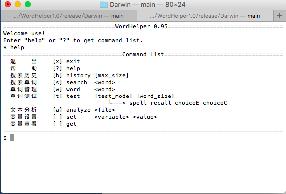

- [GitHub](https://github.com/wangrunji0408/WordHelper)
- 合作同学：@abcbdf @Pengbinghui
- 相关技术：C++，OOP，CLI
- 投入时间：50h
- 项目收获：★★★
- 同款推荐：[WDict](https://github.com/twd2/WDict)

### QtCalendar

GUI 日历

> 大学四年最恐怖的一周，Qt 从入门到放弃

* [GitHub](https://github.com/wangrunji0408/QtCalendar)
* 相关技术：C++，Qt，GUI
* 投入时间：50h
* 项目收获：★★★★

### QtGobang

联机对战五子棋

- [GitHub](https://github.com/wangrunji0408/QtGoBang)
- 相关技术：C++，Qt，Socket
- 投入时间：10h
- 项目收获：★★★

### PinyinInputer

基于 N-Gram 算法的拼音输入法

> 虽然算法实现得效果很差，不过 C# 写起来还是爽的

- [GitHub](https://github.com/wangrunji0408/PinyinInputer)
- 相关技术：C#
- 投入时间：10h
- 项目收获：★★★

### FourChess

四子棋 AI

> 搜索剪枝的艺术

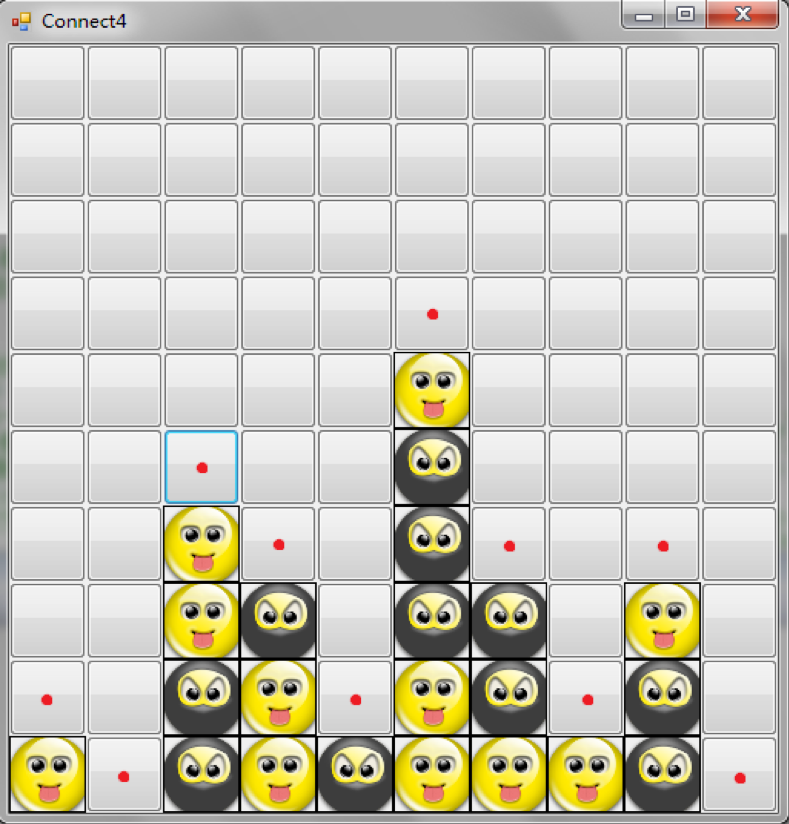

* 相关技术：C++，Alpha-beta pruning，MCTS
* 投入时间：20h
* 项目收获：★★★

### Balance

FPGA 平衡球游戏

> 面对示波器和采样信号，陷入无穷的绝望

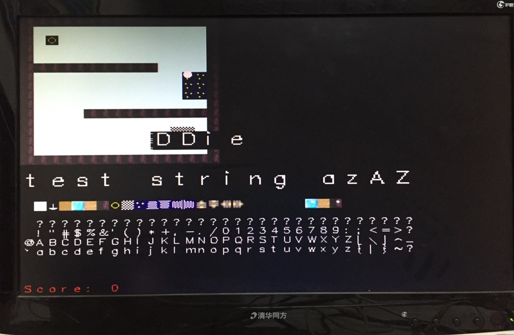

- [GitHub](https://github.com/wangrunji0408/Balance)
- 合作同学：@abcbdf
- 相关技术：VHDL
- 投入时间：80h
- 项目收获：★★★★
- 同款推荐：[WOW_CROW](https://github.com/Colin97/WOW_CROW)

### RayTrace

光线追踪 + Bezier 曲面渲染器

> 您渲染得真棒！👍👍
>
> PPM 没调出来，好气啊！
>
> 别人用祖传代码拿一样的分，好气啊！

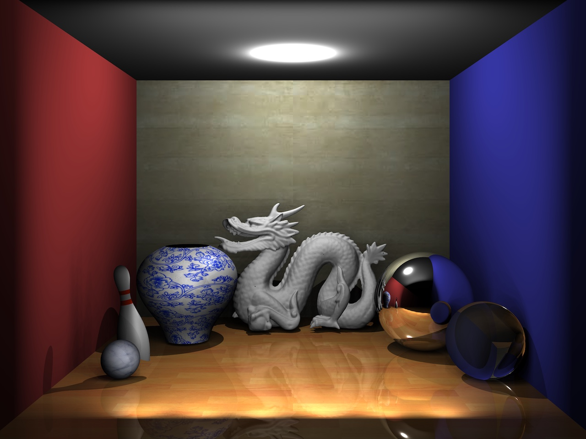

开发全程渲染图片集合：

https://www.bilibili.com/video/av11629310/

- [GitHub](https://github.com/wangrunji0408/RayTrace)
- 相关技术：C++，RayTrace
- 投入时间：80h
- 项目收获：★★★★★
- 同款推荐：[ray_tracer (Rust)](https://github.com/MashPlant/ray_tracer)

### SeamCarving

SeamCarving 算法

> 解锁成就【分手大师】

- [GitHub](https://github.com/wangrunji0408/SeamCarving)
- 相关技术：C++，SeamCarving
- 投入时间：10h
- 项目收获：★★★

### ParallelHomework

《并行程序设计》课程作业

> 寶島臺灣，好山好水好地方

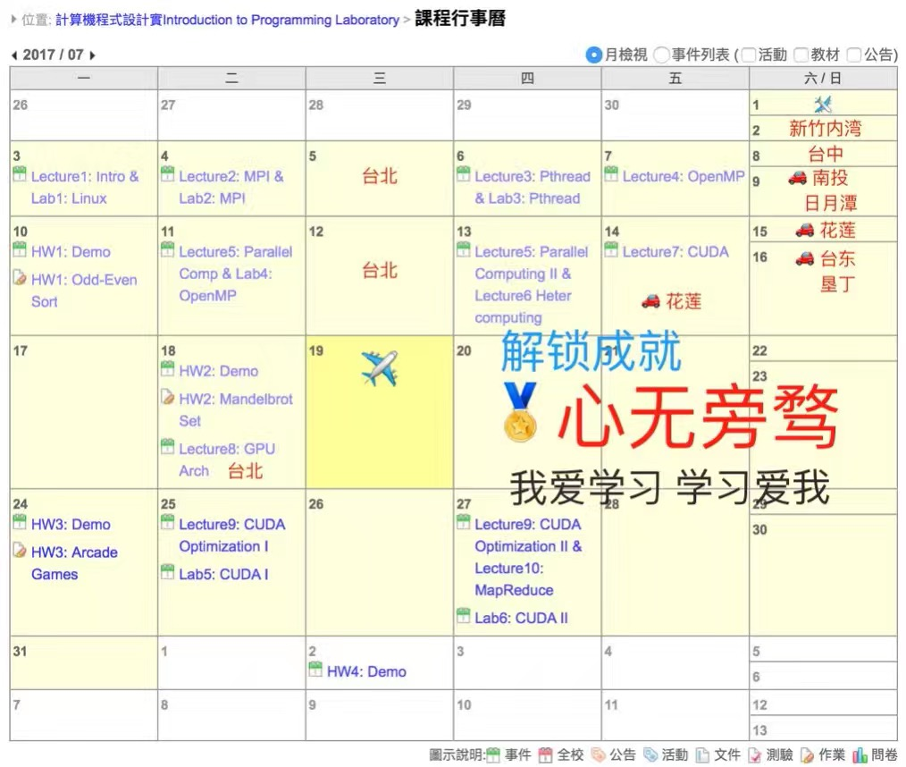

- [GitHub](https://github.com/wangrunji0408/ParallelHomework)
- 相关技术：MPI，OpenMP，pthread，CUDA
- 投入时间：50h
- 项目收获：★★★★

### MediaManager

Web 网盘。我负责编写前端。

> 软件工程：上课、考试、作业，互不相交

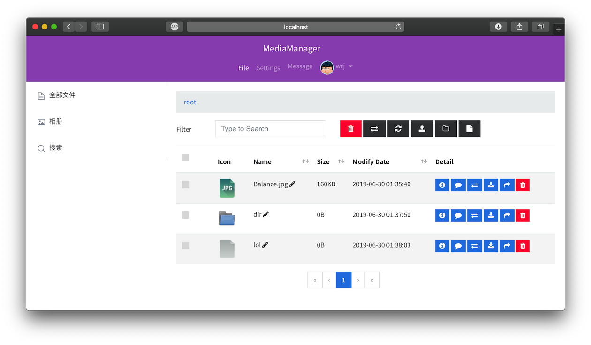

- Github：[前端](https://github.com/wangrunji0408/MediaManager_FrontEnd)，[后端](https://github.com/OmmyZhang/MediaManager)
- 合作同学：@OmmyZhang @Program-Bear @ArtanisTHU @(Shiyuan Wang)
- 相关技术：HTML，TypeScript，Vue，Swagger
- 投入时间：100h
- 项目收获：★★★★

### DbProject

简单的数据库。项目要求同 Stanford CS346 RedBase。

> 用户态系统软件的集大成者，应该用 Rust 的……

- [GitHub](https://github.com/wangrunji0408/DBProject)
- 合作同学：@benpigchu
- 相关技术：C++，Database，GoogleTest
- 投入时间：70h
- 项目收获：★★★★

### CPUProject

MIPS16e 指令集 CPU

支持 VGA 显存，中断，调试界面等

> 奋战三星期，造台计算机！

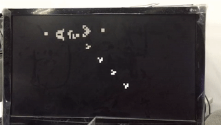

- [GitHub](https://github.com/wangrunji0408/CPUProject)
- 合作同学：@OmmyZhang @sholsyjy
- 相关技术：VHDL，CPU，MIPS
- 投入时间：150h
- 项目收获：★★★★★
- 同款推荐：[THCOMIPS16e](https://github.com/twd2/THCOMIPS16e)

### SocketChat

基于 Linux Socket 的聊天软件

> 我想回炉重造路由器

- [GitHub](https://github.com/wangrunji0408/SocketChat)
- 相关技术：C++，Socket，Protobuf
- 投入时间：10h
- 项目收获：★

### DecafCompiler

《编译原理》课程实验

> 2 学分，4 学时

* [GitHub](https://github.com/wangrunji0408/DecafCompiler)
* 相关技术：Java
* 投入时间：40h
* 项目收获：★★★

### rCore

用 Rust 语言实现的小型操作系统。

基于 BlogOS，参考 uCore，兼容 Linux。

> 天灭 C/C++，Rust 保平安。

- [GitHub](https://github.com/rcore-os/rCore)
- 合作同学：太多了
- 相关技术：Rust，OS
- 投入时间：500+h
- 项目收获：★★★★★
- 同款推荐：[JudgeDuck](https://github.com/JudgeDuck/JudgeDuck-OS)

### riscv32i-cpu

RISC-V32I 指令集 CPU。能跑 rCore！

> 奋战五星期，再造一台计算机……

- [GitHub](https://github.com/riscv-and-rust-and-decaf/riscv32i-cpu-chisel)
- 合作同学：@OmmyZhang @Hoblovski
- 相关技术：Scala，Chisel，Verilog，CPU，RISCV
- 投入时间：100h
- 项目收获：★★★★
- 同款推荐：[SystemOnCat](https://github.com/char-fish-after-lunch/SystemOnCat)

### CompilationTrainingExp

《编译原理专题训练》课程实验。

包括：数据流分析，代码优化，符号执行。

> 编译还是太硬核了

- [GitHub](https://github.com/wangrunji0408/CompilationTrainingExp)
- 相关技术：Java，LLVM，Z3
- 投入时间：30h
- 项目收获：★★★★

## 数字娱乐设计双学位课程设计

### VisionFaces

蜜汁相亲现场辅助软件（雾）

打开摄像头，通过人体视觉信息检测，显示对方信息。使用 Face++ API。

> 识别准确率感人，大家玩得开心就好……

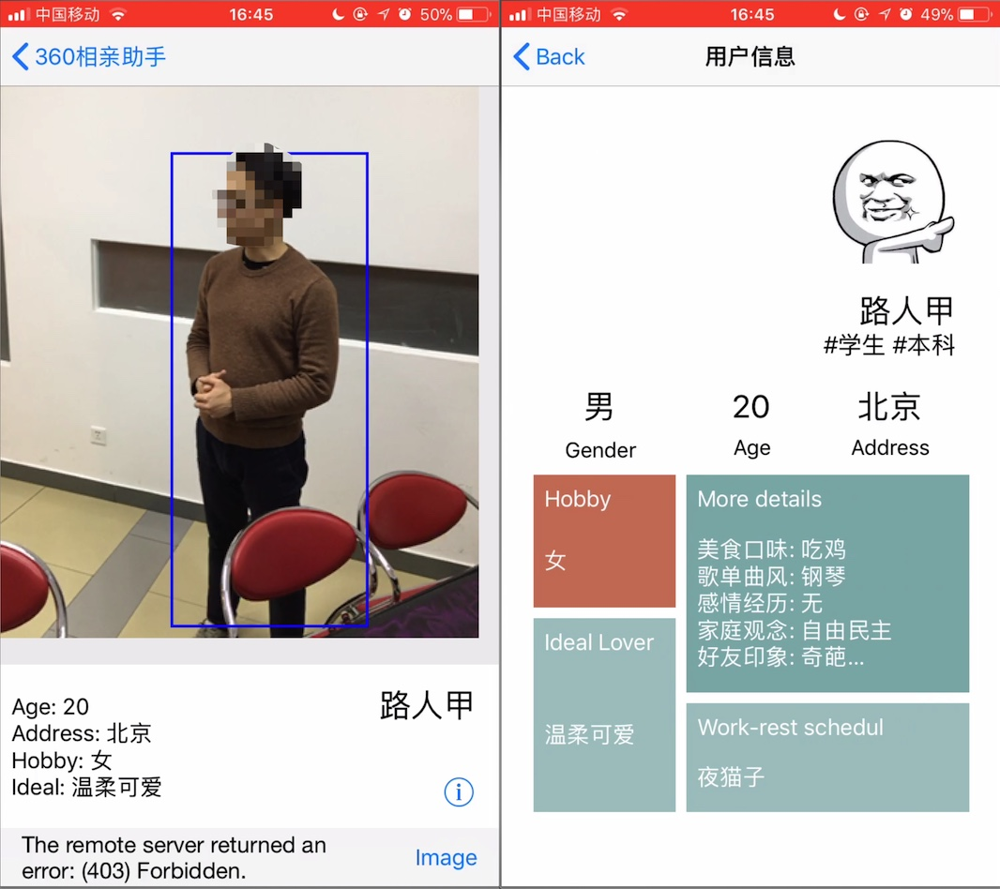

* 合作同学：@(Xingyu Lan) @(Jing Jia) @(Jing Wu)
* 相关技术：iOS，Xamarin，API Server
* 投入时间：30h
* 项目收获：★★

### MagicWand

多功能游戏交互手柄

> 我们重新发明了 switch！

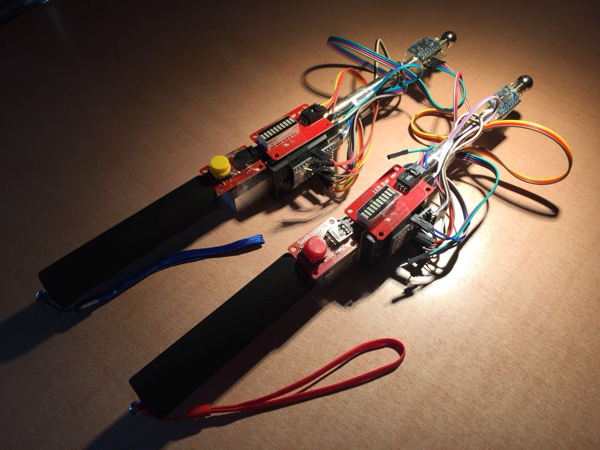

* [GitHub](https://github.com/wangrunji0408/MagicWand)
* 合作同学：@(Xingyu Lan) @(Zhi Wang)
* 相关技术：Arduino，Processing
* 投入时间：30h
* 项目收获：★★★

### WanZheBiDong

万折必东：以明朝万历时期为背景的文字冒险教育游戏

> 第一次正式做游戏，感谢策划和美术大佬带飞~

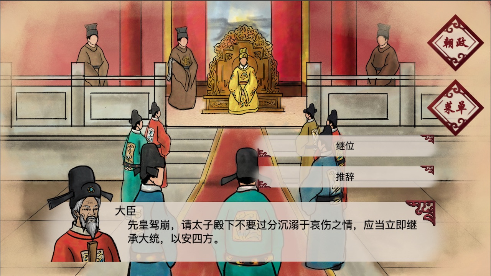

* [GitHub](https://github.com/wangrunji0408/WanZheBiDong)
* 合作同学：@(Shuo Zhang) @(Danyu Li)
* 相关技术：Cocos Creator，Typescript
* 投入时间：50h
* 项目收获：★★★★

## 课外比赛及个人项目

### Snake2

第一届北京大学游戏对抗邀请赛：双人贪食蛇 AI 对战游戏

> 王司机：剪枝一时爽，一直剪枝一直爽

* [官方网站](https://www.botzone.org.cn/static/gamecontest2015s.html)
* 合作同学：@abcbdf
* 相关技术：C++，Alpha-beta pruning
* 投入时间：50h
* 项目收获：★★★★

### Dorado

第 20 届清华大学智能体大赛：类 Dota 双人 AI 对战游戏

>赵神太强了！我好菜呀（

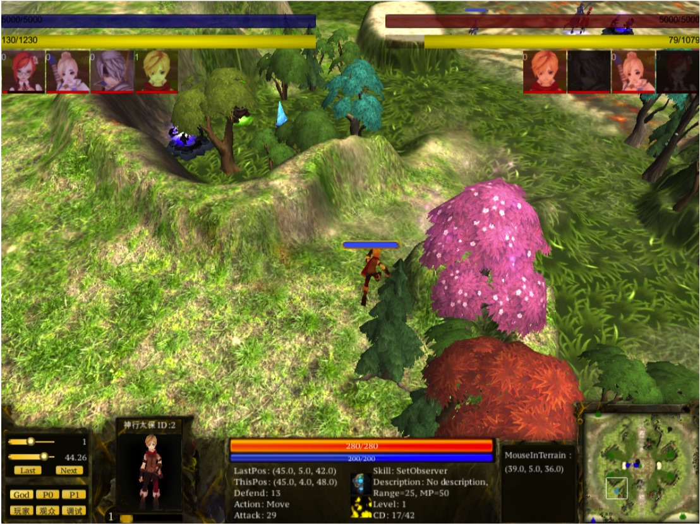

* [官方网站](https://ai.net9.org)
* 相关技术：C++，乱搞
* 投入时间：50h
* 项目收获：★★★

### iOSCalculator

简易 iOS 计算器，CS193p 课程作业。

> XCode 10.2 不支持 Swift 3.0，打不开了……

* [GitHub](https://github.com/wangrunji0408/iOSCalculator)
* 相关技术：Swift，iOS
* 投入时间：5h
* 项目收获：★★

### DinosaurJump

仿 Chrome 小恐龙游戏

> 模仿是最好的学习

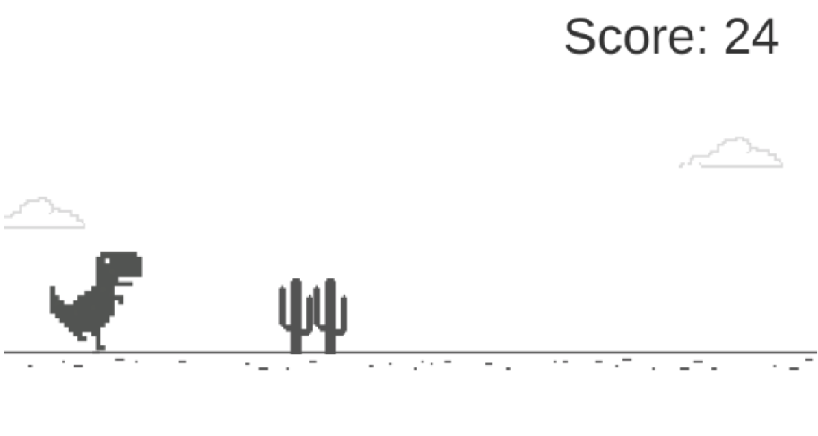

* [GitHub](https://github.com/wangrunji0408/DinosaurJump)
* 相关技术：C#，Unity
* 投入时间：10h
* 项目收获：★★★★

### Chat

C# 聊天服务器和客户端

> C# 是实现业务逻辑的完美语言

* [GitHub](https://github.com/wangrunji0408/Chat)
* 相关技术：C#，.Net Core，DDD，gRPC，Entity Framework
* 投入时间：70h
* 项目收获：★★★★